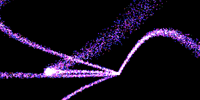

<h1 style="text-align: center">Kessler</h1>


Maybe you remember the old Apple screen saver. This is an attempt at recreating something like it, except as an animated desktop background for the X Window System. Made for personal use -- the color scheme might be busted on your end.

<p align="center">

    

</p>

<h3 align="center">A Low Res Preview:</h3>

<p align="center">
  
</p>

### Built using

- [x11rb](https://github.com/psychon/x11rb)
- [rand](https://github.com/rust-random/rand)

### Configuration options:

```bash
TODO:

./kessler --fps --particle-growth-rate --max-particle-count --etc.
```

### How does it work?

While there seems to be a lot of highly non-linear bad-ness going on, it is actually rather simple. The program generates a bunch of [Bézier curves](https://en.wikipedia.org/wiki/B%C3%A9zier_curve) as a function of time, and then applies some noise. The fade-to-white effect simply comes from a saturating add to the color buffer instead of an overwrite.